# Grasscutter Tools

[](https://github.com/jie65535/GrasscutterCommandGenerator/blob/main/LICENSE)
[](https://github.com/jie65535/GrasscutterCommandGenerator/stargazers)
[](https://github.com/jie65535/GrasscutterCommandGenerator/releases)
[](https://github.com/jie65535/GrasscutterCommandGenerator/releases/latest)
[](https://github.com/jie65535/GrasscutterCommandGenerator/actions/workflows/build.yml)
[](http://qm.qq.com/cgi-bin/qm/qr?_wv=1027&k=fBizzp6RwJsIY7gFlmd4L-WG0V3aF8X3&authKey=mTjf%2B7jCIZess1HTRi05e5yi%2FHKA1auMwE8%2FJ960PFWk8WMATST654gWPi4OTHTZ&noverify=0&group_code=835489603)

English | [简体中文](README_zh-cn.md) | [繁體中文](README_zh-tw.md) | [Русский](README_ru-RU.md)

## Commands Generator

Please download the latest committed automated build from [Action](https://github.com/jie65535/GrasscutterCommandGenerator/actions/workflows/build.yml), or a release from [Releases](https://github.com/jie65535/GrasscutterCommandGenerator/releases) (may be behind)

Support 简体中文, 繁體中文, English and Русский languages.

> **Warning**: app look may be different rather than on screenshots. It may also contain translation errors and a lack of certain resources. **We're welcome everyone to contribute to their [improvement](/Source/GrasscutterTools/Resources/en-us)**

## Remote command

The server require [gc-opencommand-plugin](https://github.com/jie65535/gc-opencommand-plugin) support


> If you cannot connect to the server, please make sure the server address is correct.
>
> It is recommended to configure the server to HTTP mode, as shown in the figure(config.json):
> 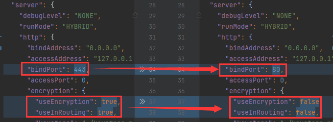
> 
> You can visit http://127.0.0.1/status/server with a browser to test whether the service is working properly.
>
> If you are not using port `80`, specify the port number to access in the url: http://127.0.0.1:443

## Update log

### GrasscutterTools-v1.13
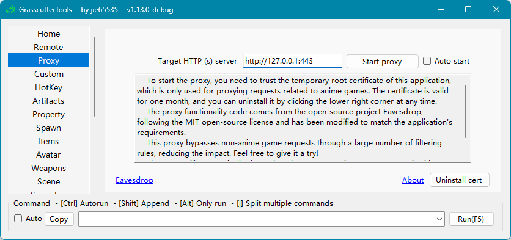

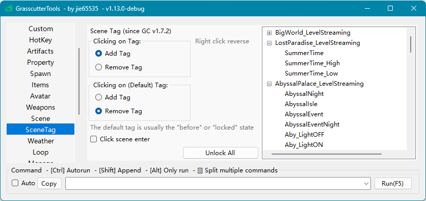

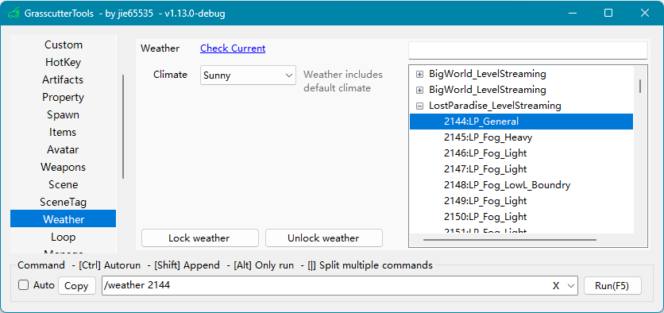


### GrasscutterTools-v1.11
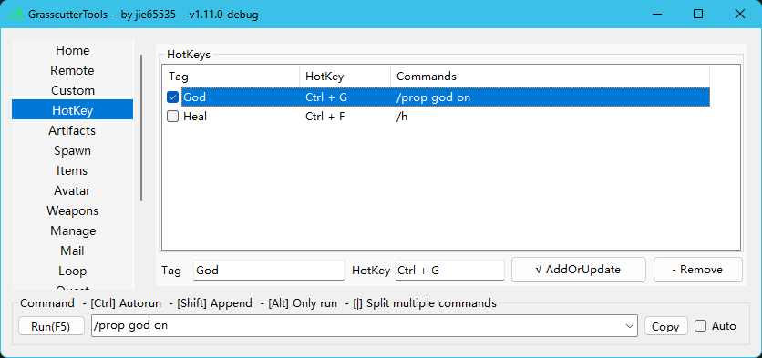

Commandline Usages:
```bash
GcTools.exe -help
GcTools.exe -version
GcTools.exe -c "cmd arg"
GcTools.exe -c "cmd1 arg" && GcTools -c "cmd2 arg1 arg2"
GcTools.exe -host http://127.0.0.1:443 -token 123456 -c "cmd1 arg1 arg2 | cmd2 | cmd3 arg"
```

### GrasscutterTools-v1.10
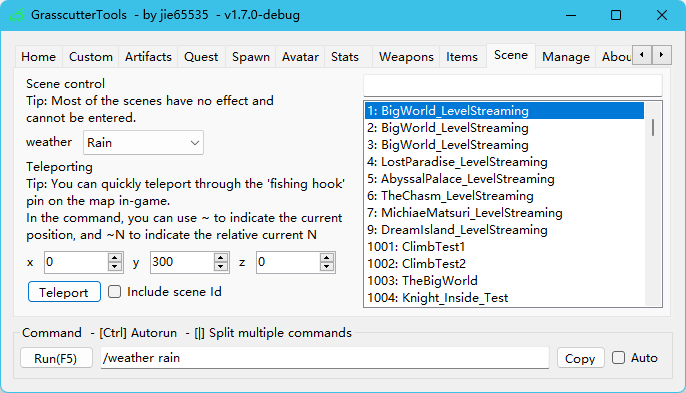

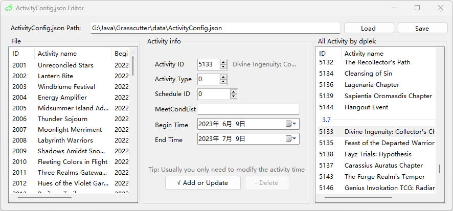

### GrasscutterTools-v1.9
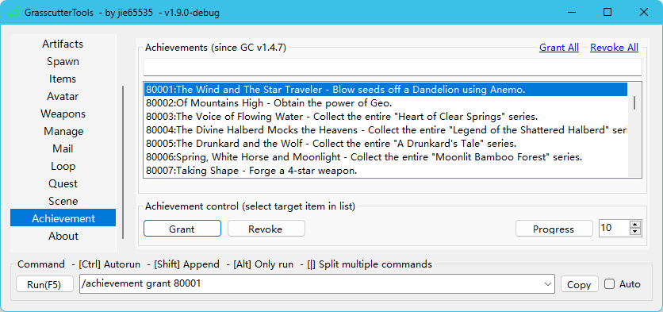

### GrasscutterTools-v1.8
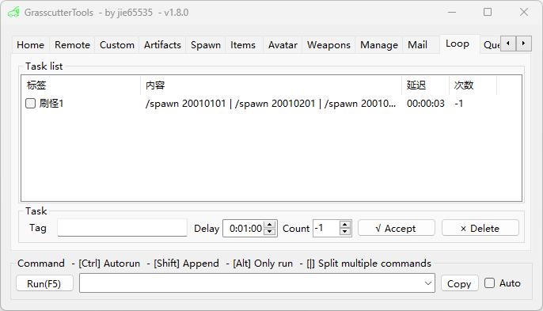

### GrasscutterTools-v1.7.3
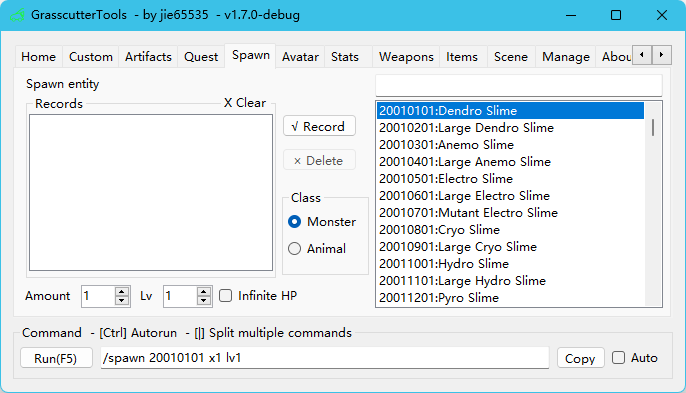

Added [AttackModifier](https://github.com/NotThorny/AttackModifier), [AttackInfusedWithItem](https://github.com/snoobi-seggs/AttackInfusedWithItem), [SwitchElementTraveller](https://github.com/Penelopeep/SwitchElementTraveller) plugins command generation


### GrasscutterTools-v1.7.2
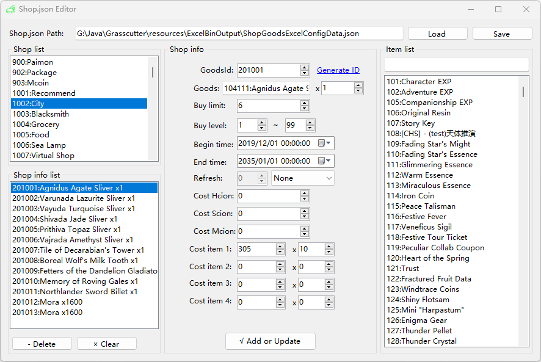

### GrasscutterTools-v1.7.1
 - Gadgets(CHS Only)

### GrasscutterTools-v1.7.0


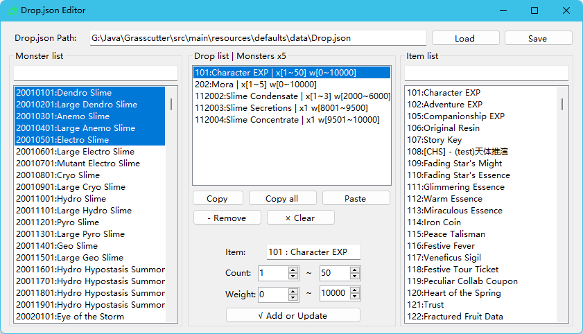

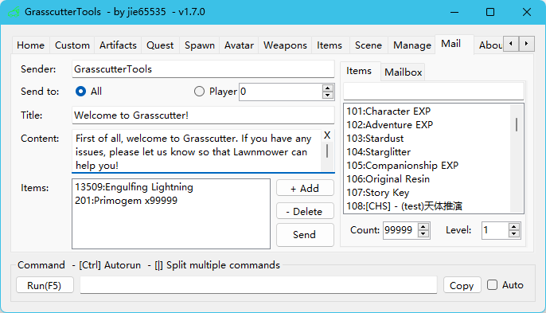

---


## Screenshots


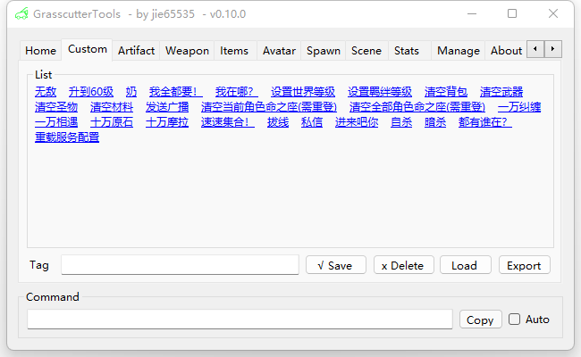

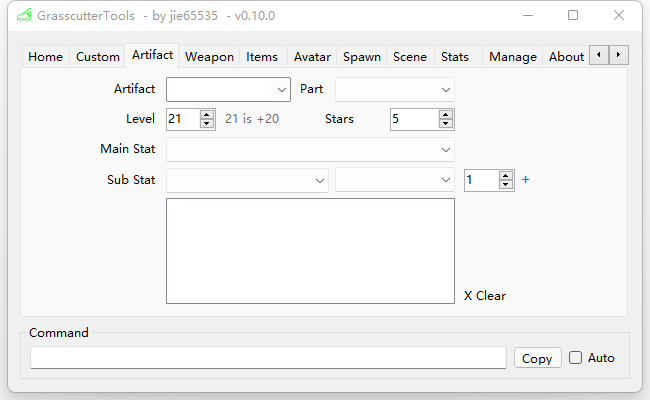

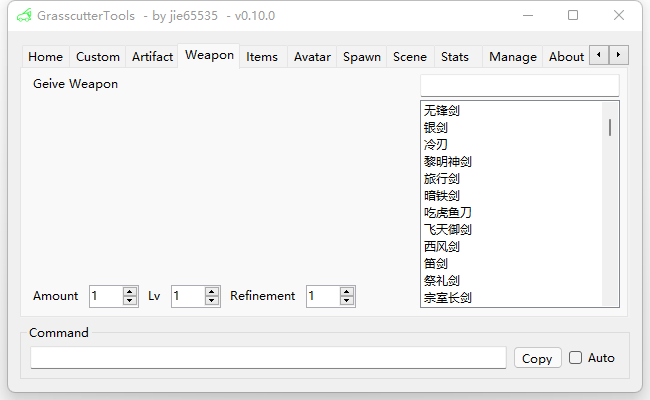

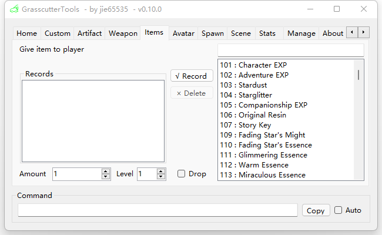

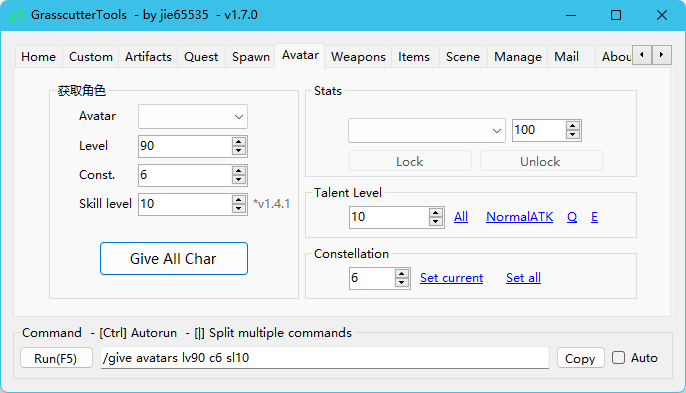


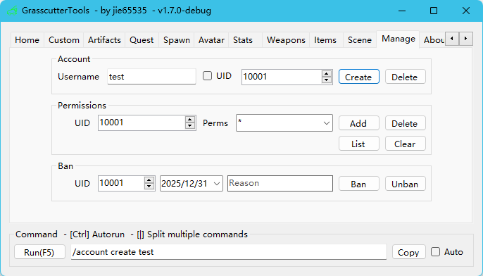

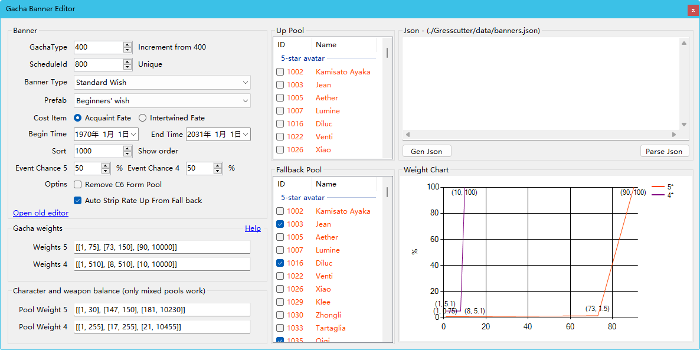


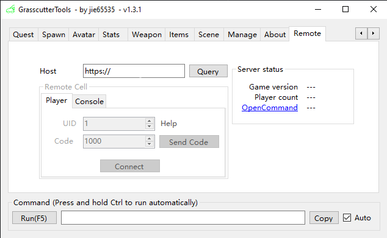

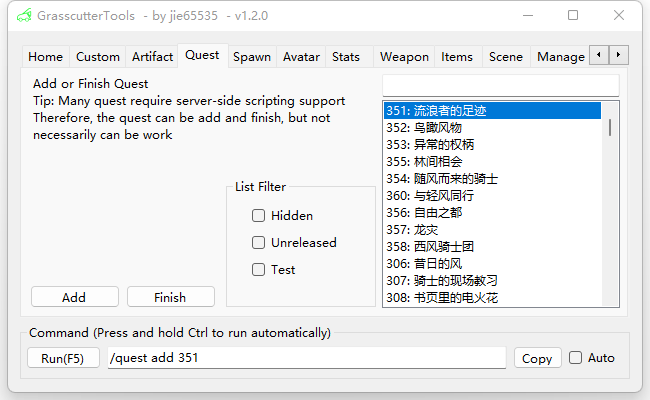
