# Grasscutter Tools

中文 | [EN](README_en-US.md)

## Commands Generator

请从 [Releases](https://github.com/jie65535/GrasscutterCommandGenerator/releases) 中获取最新版本

---

## TODO List
  - [ ] 多语言支持（进度：UI已经支持英语，但还有许多ID映射文件缺失，欢迎补充）
    - [ ] Animal.txt
    - [ ] Artifact.txt
    - [ ] ArtifactCat.txt
    - [ ] ArtifactMainAttribution.txt
    - [ ] ArtifactSubAttribution.txt
    - [x] Avatar.txt
    - [ ] CustomCommands.txt
    - [x] Item.txt
    - [x] Monster.txt
    - [ ] NPC.txt
    - [ ] Ornament.txt
    - [x] Scene.txt
    - [ ] Weapon.txt
  - [ ] 远程执行命令（进度：新建文件夹）
  - [ ] 割草机启动器（无进度）
  - [ ] 邮件编辑器（无进度）
  - [ ] 商店编辑器（无进度）

## v0.10.0-M1
- `主页` 页面新增 `语言` 下拉框，可选择简体中文和英语。
- `生成` 页面新增 `摆件` ID分类。

## v0.9.0
命令@UID随版本重构（指令中指定ID改为`@ uid`，因此与旧版本服务端不兼容，不使用`指令含UID`则不影响）

权限管理新增下拉框选择权限（方便选择）

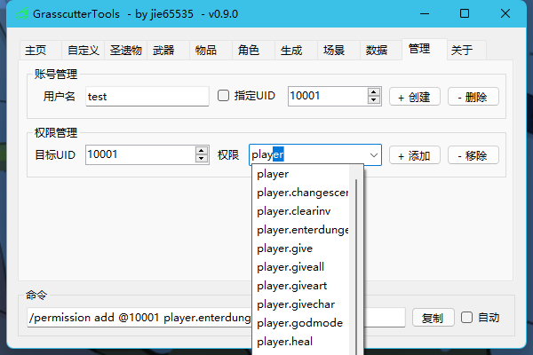

场景页面新增天气设置（呼风唤雨~）

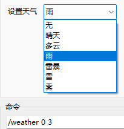

## v0.8.0

圣遗物套装下拉框可键入提示

`状态` 标签改为 `数据`，设置角色数据模块重构，支持最新版指令。_（部分属性旧版本可能不支持）_

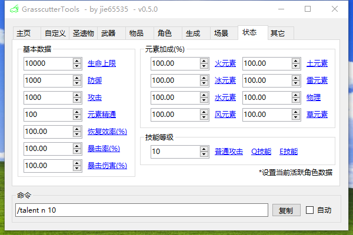

`其它` 页面改为 `管理` ，新增帐号创建和删除。

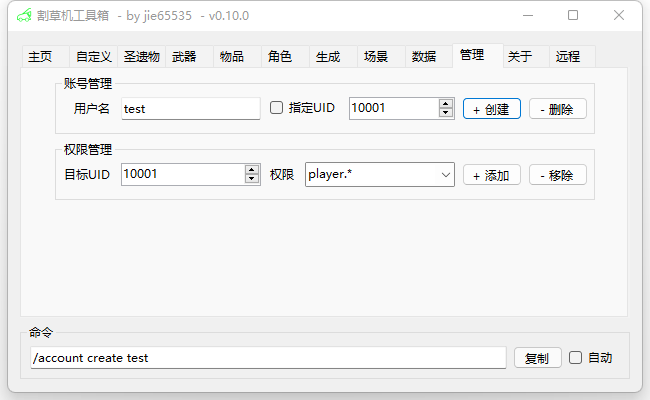

## v0.7.0

物品生成记录本

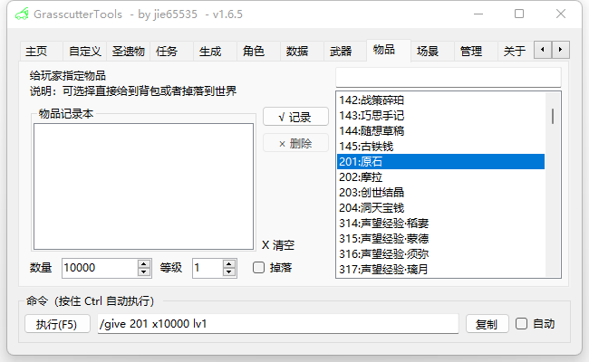

实体生成记录本

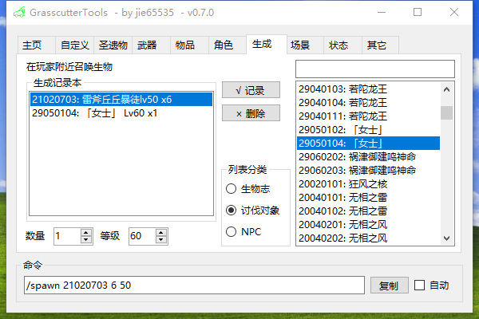

## v0.6.0

新增奖池编辑器

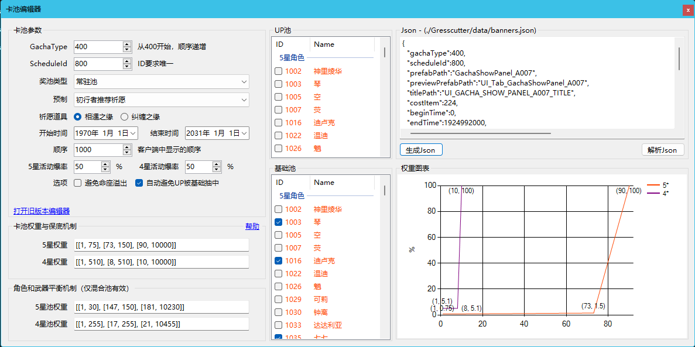

## Screenshots

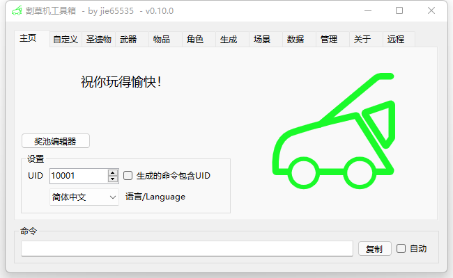

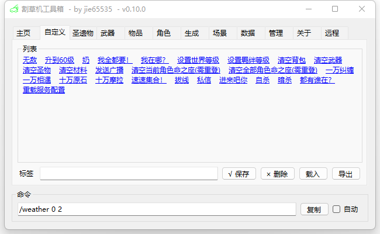

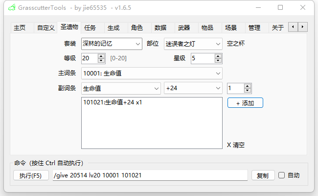

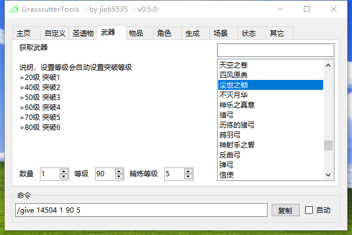

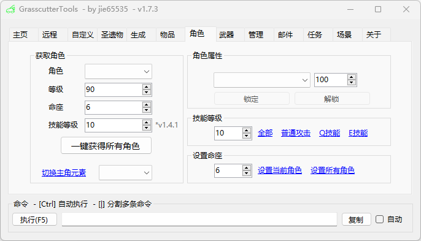

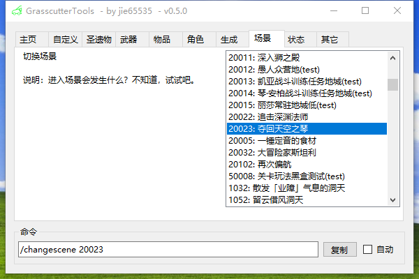

