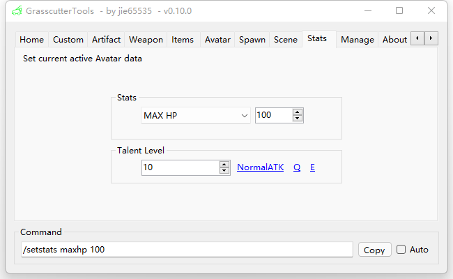

# Grasscutter Tools

[中文](README.md) | English | [Русский](README_ru-RU.md)

## Commands Generator

Please download the latest version from [Releases](https://github.com/jie65535/GrasscutterCommandGenerator/releases)

## Remote command

The server require [gc-opencommand-plugin](https://github.com/jie65535/gc-opencommand-plugin) support

---

## TODO List
  - [ ] Multi-language support
    - [x] Simplified Chinese
    - [x] English
    - [x] Russian
  - [x] Execute command remotely
  - [ ] Mail Editor (no progress)
  - [ ] Shop Editor (no progress)

## Screenshots

