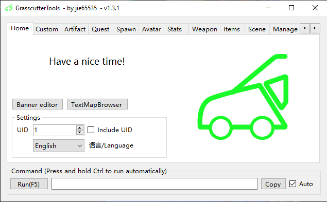

# Grasscutter Tools

[中文](README.md) | EN

## Commands Generator

Please download the latest version from [Releases](https://github.com/jie65535/GrasscutterCommandGenerator/releases)

---

## TODO List
  - [ ] Multi-language support (progress: UI already supports English, but there are still many ID mapping files missing, welcome to add)
    - [ ] Animal.txt
    - [ ] Artifact.txt
    - [ ] ArtifactCat.txt
    - [ ] ArtifactMainAttribution.txt
    - [ ] ArtifactSubAttribution.txt
    - [x] Avatar.txt
    - [x] CustomCommands.txt
    - [x] Item.txt
    - [x] Monster.txt
    - [ ] NPC.txt
    - [ ] Ornament.txt
    - [x] Scene.txt
    - [ ] Weapon.txt
  - [x] Execute command remotely
  - [ ] Grasscutter Launcher (no progress)
  - [ ] Mail Editor (no progress)
  - [ ] Shop Editor (no progress)

## Screenshots

