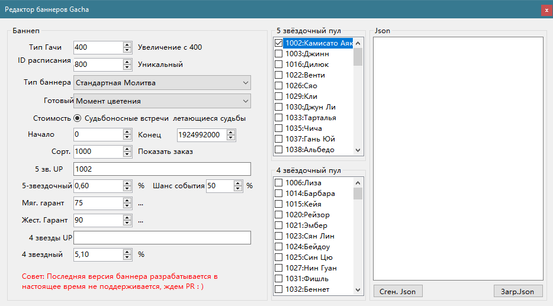
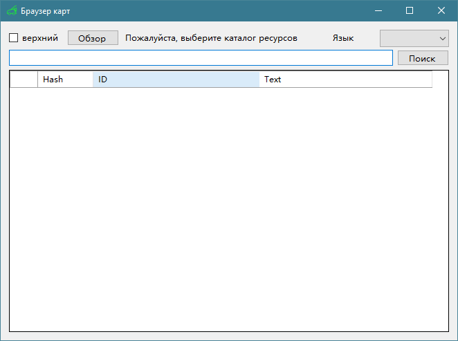

# Grasscutter Tools

[中文](README.md) | [English](README_en-US.md) | Русский - Перевод Юрий Дворецкий

## Генератор команд

Пожалуйса загрузите последнюю версию с [Releases](https://github.com/jie65535/GrasscutterCommandGenerator/releases)

## Удаленная команда

Сервер требует [gc-opencommand-plugin](https://github.com/jie65535/gc-opencommand-plugin) помощь

> If you cannot connect to the server, please make sure the server address is correct.
>
> It is recommended to configure the server to HTTP mode, as shown in the figure:
> 
> 
> You can visit http://127.0.0.1/status/server with a browser to test whether the service is working properly.
>
> If you are not using port `80`, specify the port number to access in the url: http://127.0.0.1:443/status/server

---

## Список задач
  - [x] Многоязычная поддержка
     - [x] Упрощенный китайский
     - [x] сложный китайский
     - [х] английский
     - [х] Русский
   - [x] Выполнить команду удаленно
   - [ ] ~~Редактор почты (нет прогресса)~~
   - [ ] ~~Редактор магазина (нет прогресса)~~
   - [ ] Announcement Editor (no progress)

## Скриншоты

