# Grasscutter Tools

[](https://github.com/jie65535/GrasscutterCommandGenerator/blob/main/LICENSE)
[](https://github.com/jie65535/GrasscutterCommandGenerator/stargazers)
[](https://github.com/jie65535/GrasscutterCommandGenerator/releases)
[](https://github.com/jie65535/GrasscutterCommandGenerator/releases/latest)
[](https://github.com/jie65535/GrasscutterCommandGenerator/actions/workflows/build.yml)

[English](README.md) | [简体中文](README_zh-cn.md) | [繁體中文](README_zh-tw.md) | Русский - Перевод [Юрий Дворецкий](https://github.com/yurikenjx) (с исправлениями от [EgorBron](https://github.com/EgorBron)) 

## Генератор команд (GCG)

Пожалуйста, загрузите последнюю подтвержденную автоматизированную сборку из [Action](https://github.com/jie65535/GrasscutterCommandGenerator/actions/workflows/build.yml) или выпуск из [Releases](https://github.com/jie65535/GrasscutterCommandGenerator/releases) (может отставать)

GCG поддерживает 简体中文 (китайский упр.), 繁體中文 (китайский трад.), English (английский) и Русский языки.

> **Warning**: вид приложения может отличаться от скриншотов. Также в нём могут присутствовать ошибки в переводе и отсутсвие некоторых ресурсов. **Мы приглашаем всех сделать вклад в их [улучшение](/Source/GrasscutterTools/Resources/ru-ru)**

## Удаленная команда (OpenCommand)

Чтобы использовать команды прямо из GCG, серверу требуется плагин [gc-opencommand-plugin](https://github.com/jie65535/gc-opencommand-plugin).


> Если вы не можете подключиться к серверу, проверьте правильность написания его URL-адреса.
>
> Рекомендуется изменить секцию HTTP в конфиге как на скриншоте ниже (конфиг - файл config.json):
>
> 
>
> Для проверки можете посетить http://127.0.0.1/status/server в браузере, чтобы проверить работоспособность OpenCommand.
>
> Если вы не указали порт `80` в конфиге, вам нужно указать свой порт в URL-адресе (например, http://127.0.0.1:443)


## Лог обновлений

### GrasscutterTools-v1.13


### GrasscutterTools-v1.11


Commandline Usages:
```bash
GcTools.exe -help
GcTools.exe -version
GcTools.exe -c "cmd arg"
GcTools.exe -c "cmd1 arg" && GcTools -c "cmd2 arg1 arg2"
GcTools.exe -host http://127.0.0.1:443 -token 123456 -c "cmd1 arg1 arg2 | cmd2 | cmd3 arg"
```

### GrasscutterTools-v1.10
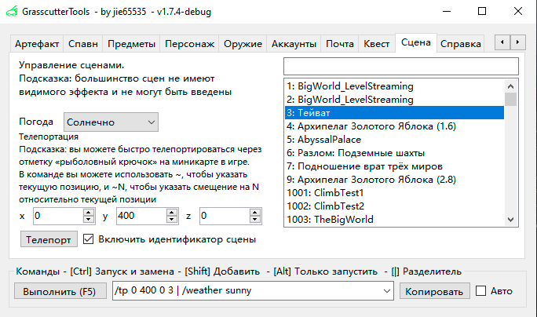

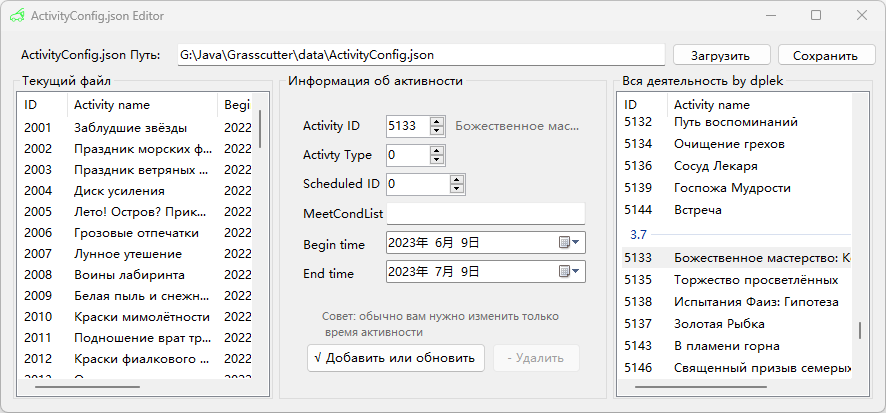

### GrasscutterTools-v1.9
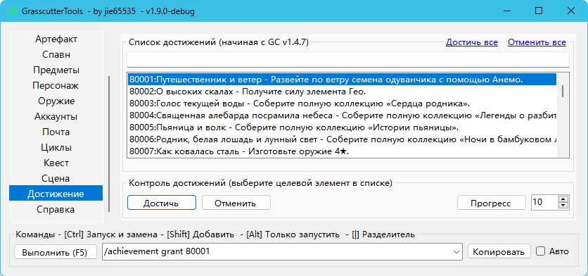

### GrasscutterTools-v1.8
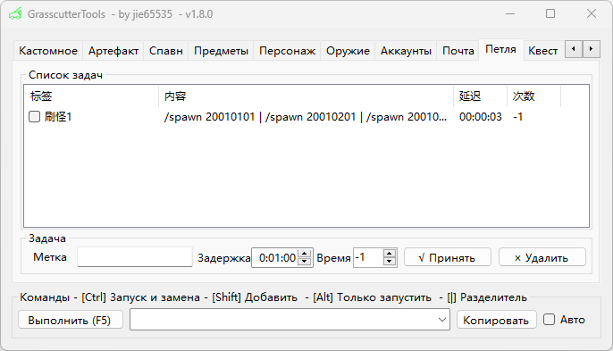

### GrasscutterTools-v1.7.3
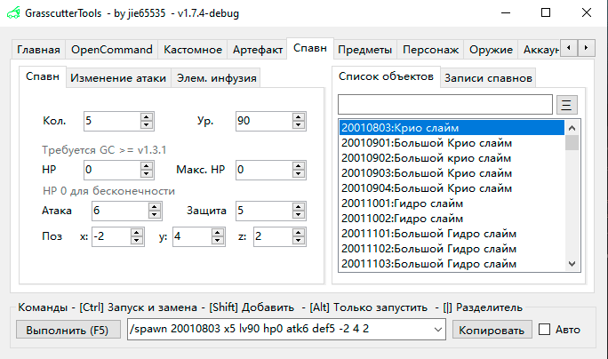

Добавлена поддержка генерации команд для плагинов [AttackModifier](https://github.com/NotThorny/AttackModifier), [AttackInfusedWithItem](https://github.com/snoobi-seggs/AttackInfusedWithItem), [SwitchElementTraveller](https://github.com/Penelopeep/SwitchElementTraveller).


### GrasscutterTools-v1.7.2
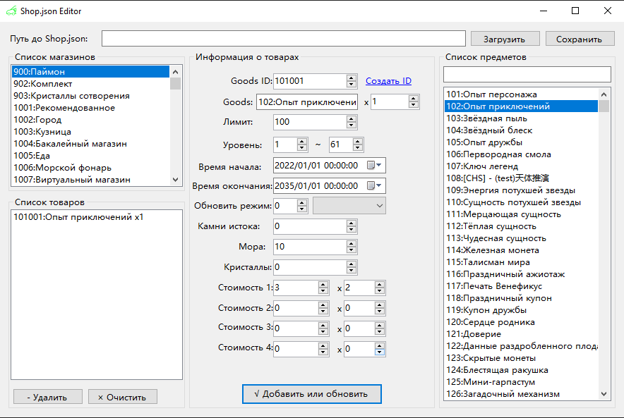

### GrasscutterTools-v1.7.1
 - Гаджеты (пока что только на китайском)

### GrasscutterTools-v1.7.0


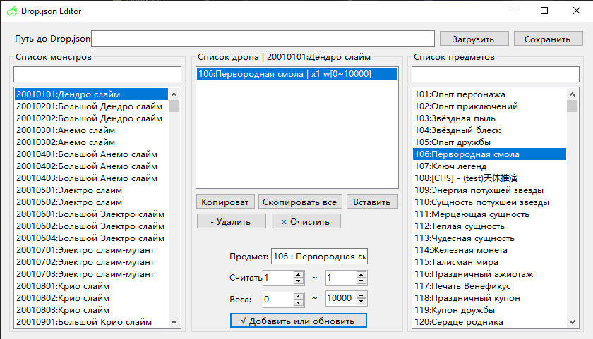

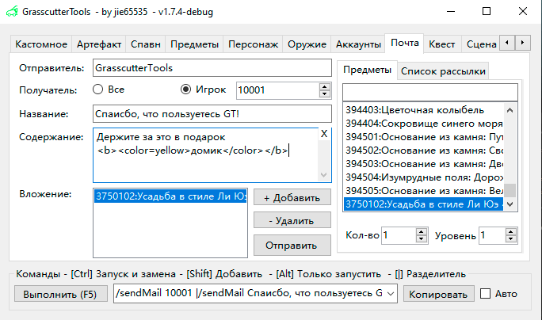

---

## Скриншоты


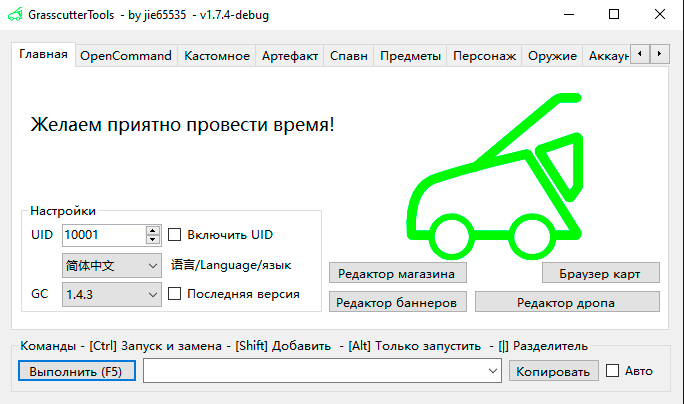

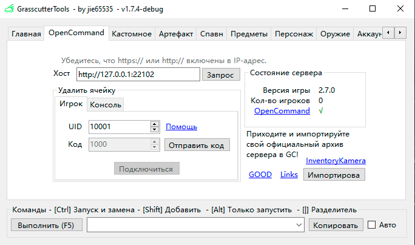

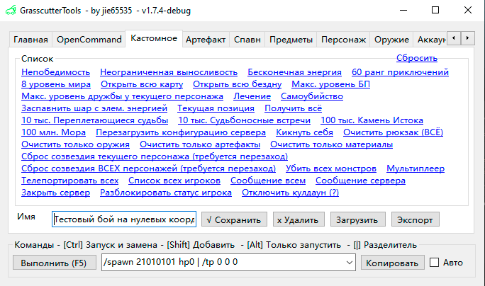

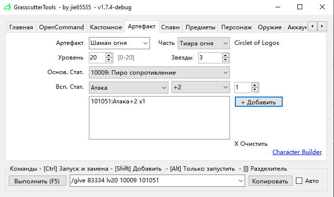


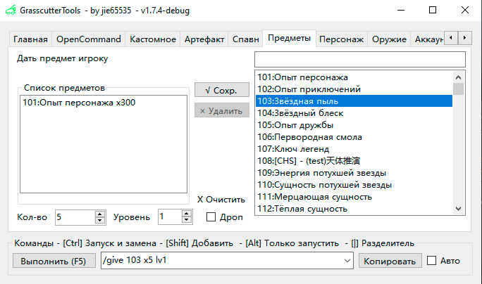

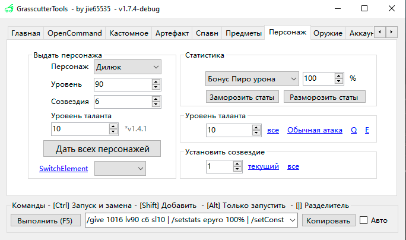

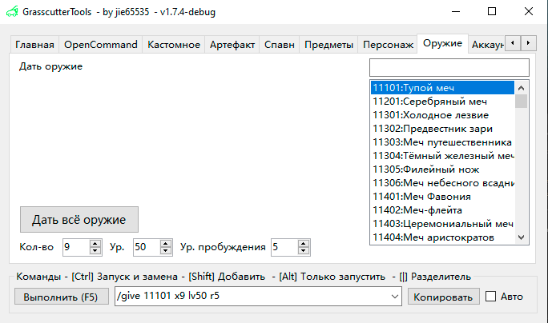

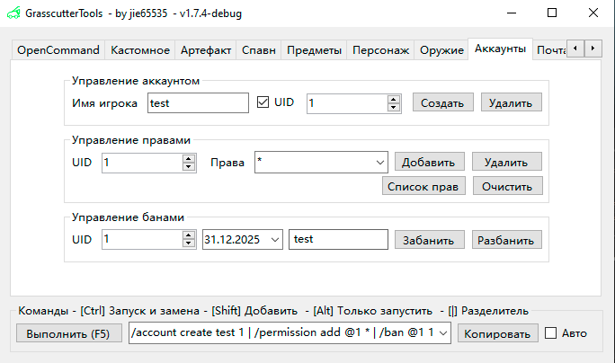


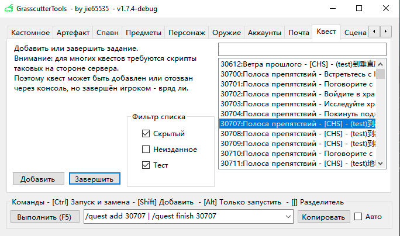


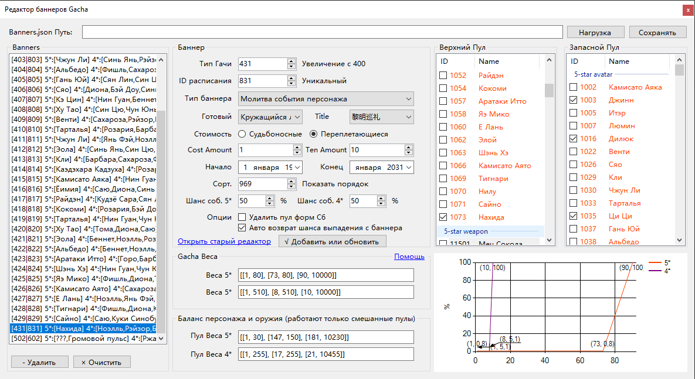


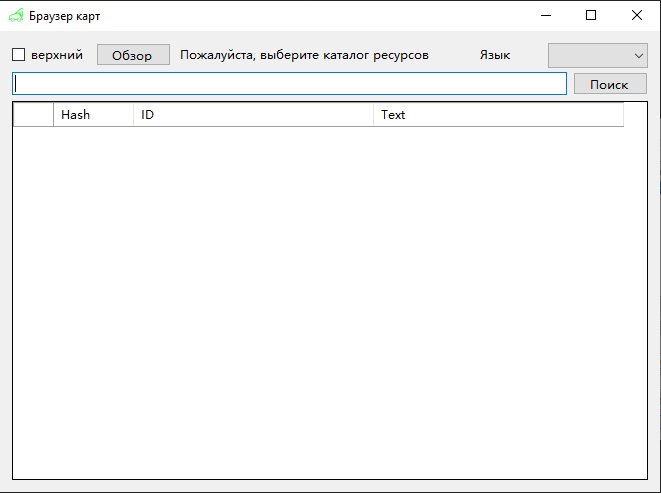