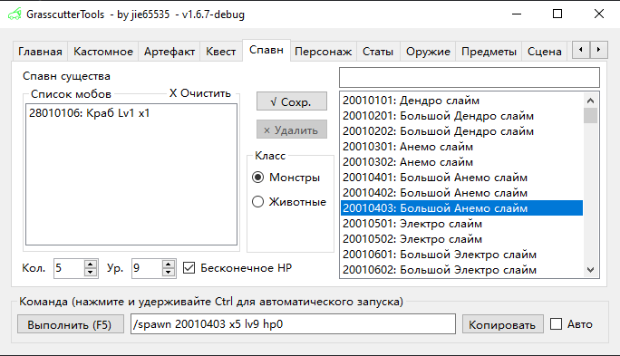
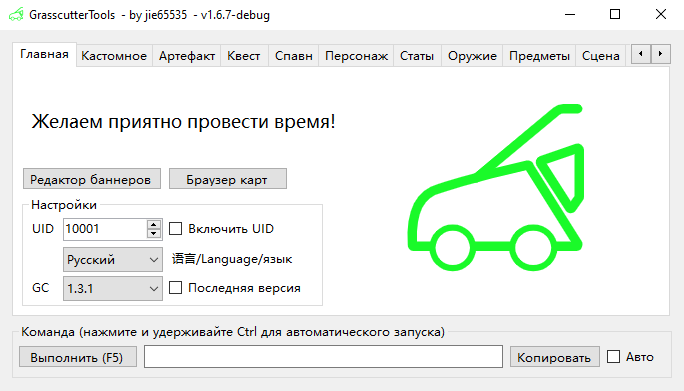
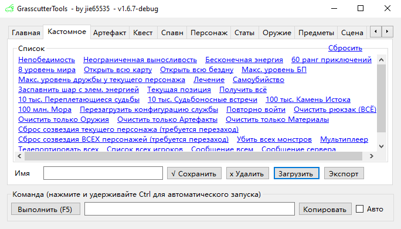
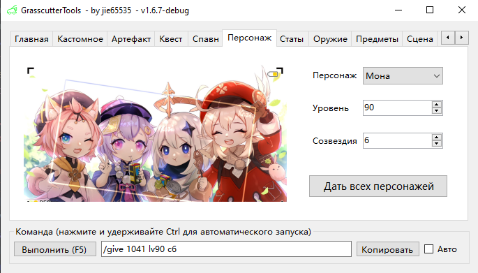
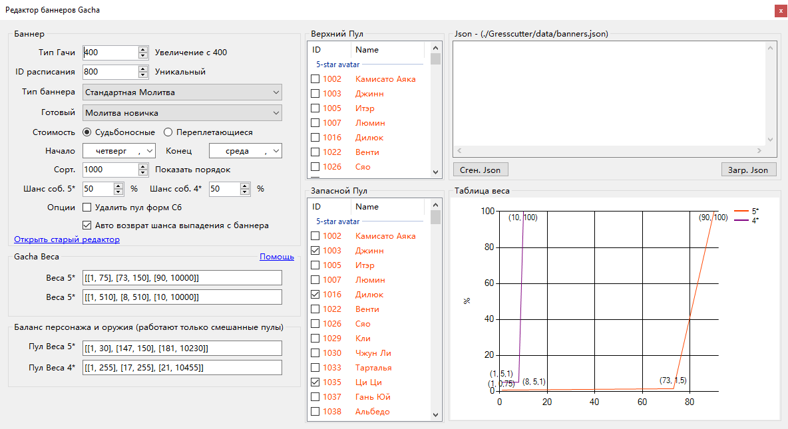

# Grasscutter Tools

[English](README.md) | [简体中文](README_zh-cn.md) | Русский - Перевод [Юрий Дворецкий](https://github.com/yurikenjx) (с исправлениями от [EgorBron](https://github.com/EgorBron)) 

## Генератор команд (GCG)

Загрузите последнюю версию из вкладки [Releases](https://github.com/jie65535/GrasscutterCommandGenerator/releases).

GCG поддерживает 简体中文 (китайский упр.), 繁体中文 (китайский трад.), English (английский) и Русский языки.

Приглашаем всех улучшить [ID ресурсов и перевод](/Source/GrasscutterTools/Resources/ru-ru)

## Update log

### GrasscutterTools-v1.7.3

### GrasscutterTools-v1.7.2

### GrasscutterTools-v1.7.1
 - Gadgets (CHS Only)

### GrasscutterTools-v1.7.0

## Удаленная команда (OpenCommand)

Чтобы использовать команды прямо из GCG, серверу требуется плагин [gc-opencommand-plugin](https://github.com/jie65535/gc-opencommand-plugin).

> Если вы не можете подключиться к серверу, проверьте правильность написания его URL-адреса.
>
> Рекомендуется изменить секцию HTTP в конфиге как на скриншоте ниже (конфиг - файл config.json):
>
> 
>
> Для проверки можете посетить http://127.0.0.1/status/server в браузере, чтобы проверить работоспособность OpenCommand.
>
> Если вы не указали порт `80` в конфиге, вам нужно указать свой порт в URL-адресе (например, http://127.0.0.1:443)

---

## Скриншоты

