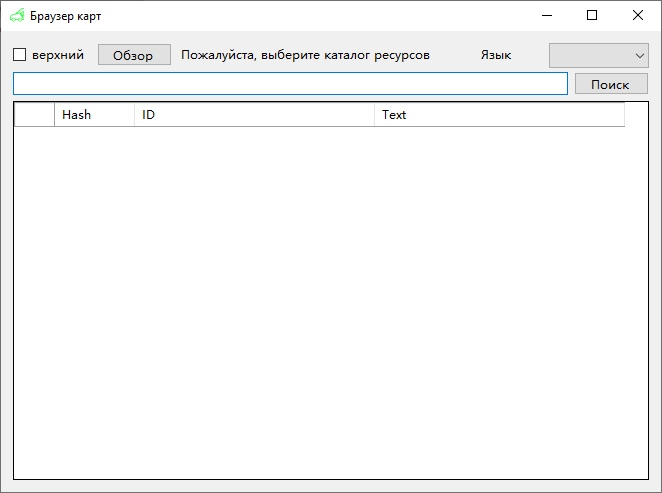

# Grasscutter Tools

[中文](README.md) | [English](README_en-US.md) | Русский - Перевод Юрий Дворецкий (с исправлениями от EgorBron) 

## Генератор команд

Пожалуйста, загрузите последнюю версию из вкладки [Releases](https://github.com/jie65535/GrasscutterCommandGenerator/releases)

Поддерживает 简中 (китайский упр.), 繁中 (китайский трад.), English (английский) и Русский языки.

## Удаленная команда

Для этого серверу требуется плагин [gc-opencommand-plugin](https://github.com/jie65535/gc-opencommand-plugin)

> Если вы не можете подключиться к серверу, проверьте правильность написания его URL-адреса. 
>
> Рекомендуется изменить секцию HTTP в конфиге как на скриншоте ниже (в файле config.json):
>
> 
>
> Для проверки можете посетить http://127.0.0.1/status/server в браузере, чтобы проверить работоспособность.
>
> Если вы не указали порт `80` в конфиге, вам нужно указать его в URL-адресе: http://127.0.0.1:443

---

## Скриншоты

