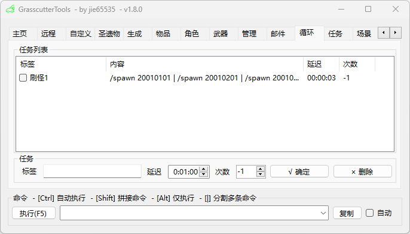
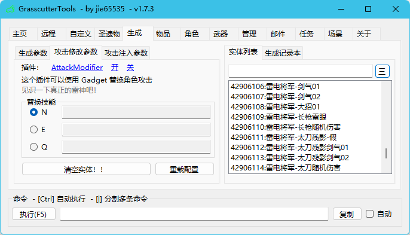
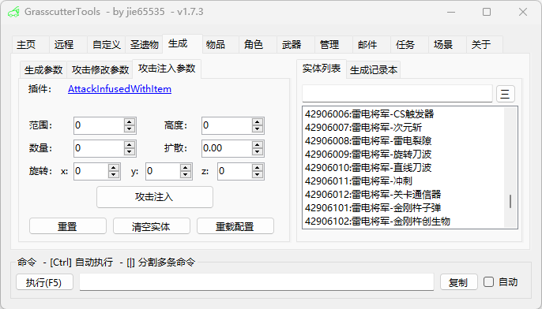
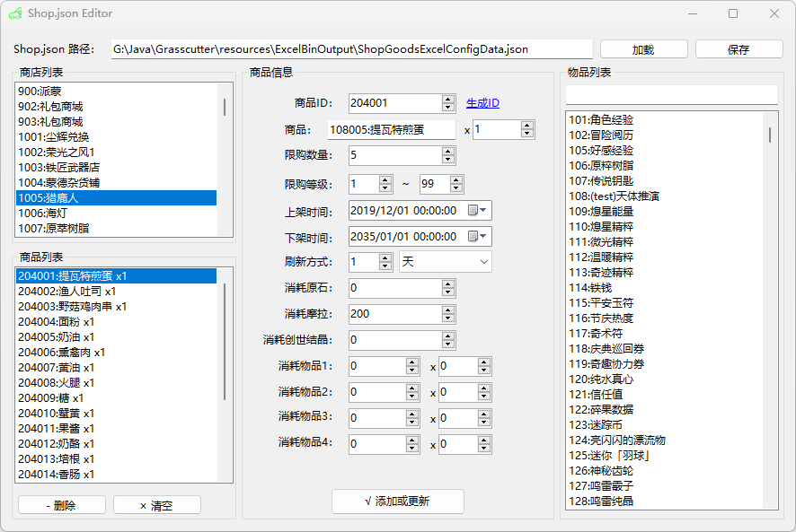
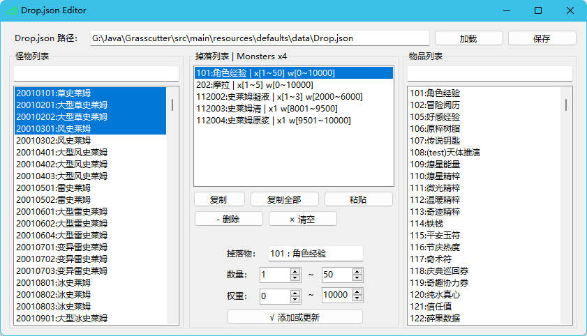
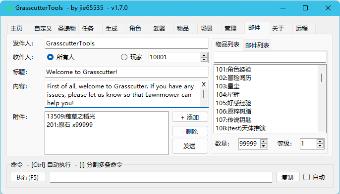
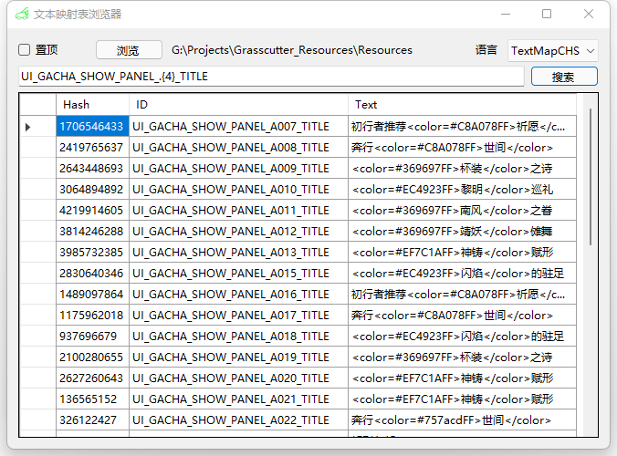
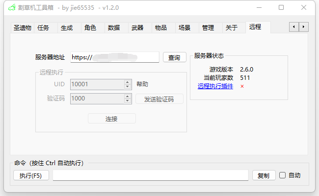
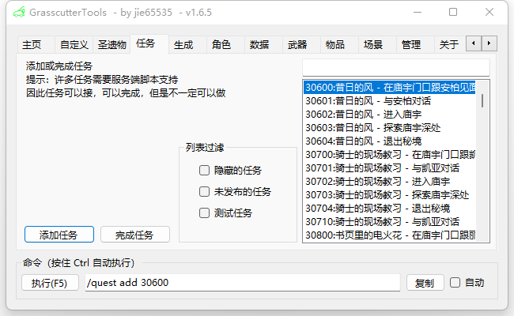

# Grasscutter Tools

[English](README.md) | 简体中文 | [繁體中文](README_zh-tw.md) | [Русский](README_ru-RU.md)

## Commands Generator

请从 [Releases](https://github.com/jie65535/GrasscutterCommandGenerator/releases) 中获取最新版本

本工具支持 简体中文, 繁體中文, English 与 Русский 语言。

> **Warning**: 应用程序的外观可能与截图上的不同。它也可能包含翻译错误和缺乏某些资源。我们欢迎大家为他们的<a href="./Source/GrasscutterTools/Resources/zh-cn">改进</a>作出贡献。

## Update log

### GrasscutterTools-v1.8

### GrasscutterTools-v1.7.3

新增[攻击修改](https://github.com/NotThorny/AttackModifier)、[攻击注入](https://github.com/snoobi-seggs/AttackInfusedWithItem)、[切换元素](https://github.com/Penelopeep/SwitchElementTraveller)等插件命令生成

### GrasscutterTools-v1.7.2

### GrasscutterTools-v1.7.1
 - 增加了 Gadgets

### GrasscutterTools-v1.7.0

## 远程执行

服务端需要 [gc-opencommand-plugin](https://github.com/jie65535/gc-opencommand-plugin) 插件支持

> 如果你无法连接到服务器，请确认填写的服务器地址是否正确。
> 
> 建议配置服务器为HTTP模式，如图所示(config.json)：
> 
> 
> 你可以用浏览器访问 http://127.0.0.1/status/server 来测试服务是否正常工作。
> 
> 如果使用的不是`80`端口，则要在url中指定访问的端口号：http://127.0.0.1:443

---

## 软件截图

