# Grasscutter Tools

[](https://github.com/jie65535/GrasscutterCommandGenerator/blob/main/LICENSE)
[](https://github.com/jie65535/GrasscutterCommandGenerator/stargazers)
[](https://github.com/jie65535/GrasscutterCommandGenerator/releases)
[](https://github.com/jie65535/GrasscutterCommandGenerator/releases/latest)
[](https://github.com/jie65535/GrasscutterCommandGenerator/actions/workflows/build.yml)
[](http://qm.qq.com/cgi-bin/qm/qr?_wv=1027&k=fBizzp6RwJsIY7gFlmd4L-WG0V3aF8X3&authKey=mTjf%2B7jCIZess1HTRi05e5yi%2FHKA1auMwE8%2FJ960PFWk8WMATST654gWPi4OTHTZ&noverify=0&group_code=835489603)

[English](README.md) | [简体中文](README_zh-cn.md) | 繁體中文 | [Русский](README_ru-RU.md) 

## 指令產生工具

請從 [Action](https://github.com/jie65535/GrasscutterCommandGenerator/actions/workflows/build.yml) 中下載最新提交的自動構建版本，或者從 [Releases](https://github.com/jie65535/GrasscutterCommandGenerator/releases) 中下載發布版本（可能落後）

本工具支援 简体中文、繁體中文、English 及 Русский 上述語言。

> **Warning**: 程式中的實際外觀可能會與截圖中的內容不同。其中也可能包含翻譯錯誤及缺乏特定資源。**我們歡迎各位為此工具做出貢獻並[改進](/Source/GrasscutterTools/Resources/zh-tw)**

## 遠端控制

伺服器需要安裝 [gc-opencommand-plugin](https://github.com/jie65535/gc-opencommand-plugin) 插件

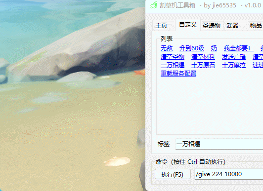

> 如果你無法連接至伺服器，請確認輸入的伺服器位址是否正確。
>
> 建議將伺服器調整為HTTP模式，如下圖所示(config.json):
> 
> 
> 你可藉由任何瀏覽器輸入網址 http://127.0.0.1/status/server 以測試伺服器是否正常運作。
>
> 如果你並非使用`80`端口, 則須在網址後輸入指定端口: http://127.0.0.1:443

## 更新日誌

### GrasscutterTools-v1.13
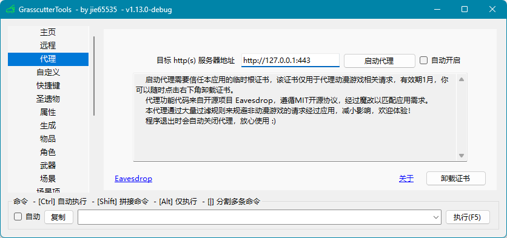

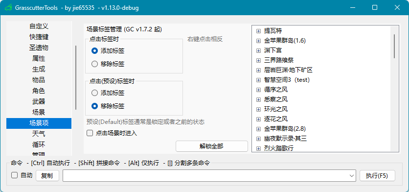


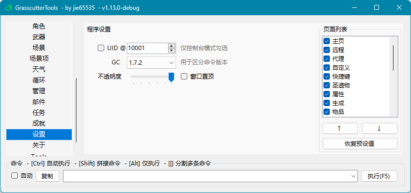

### GrasscutterTools-v1.11
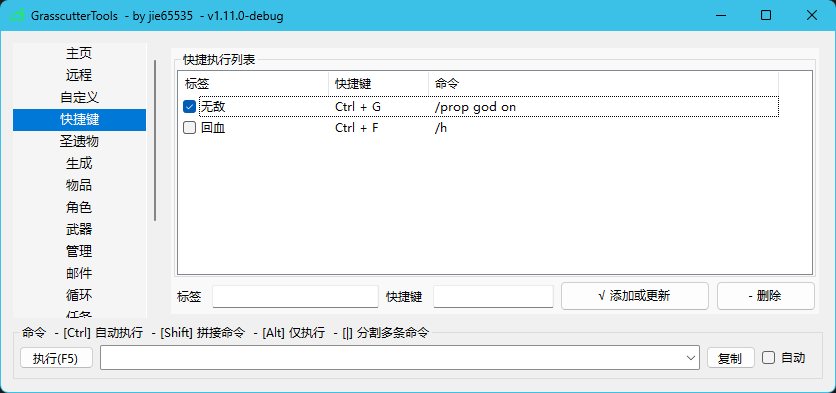

Commandline Usages:
```bash
GcTools.exe -help
GcTools.exe -version
GcTools.exe -c "cmd arg"
GcTools.exe -c "cmd1 arg" && GcTools -c "cmd2 arg1 arg2"
GcTools.exe -host http://127.0.0.1:443 -token 123456 -c "cmd1 arg1 arg2 | cmd2 | cmd3 arg"
```

### GrasscutterTools-v1.10
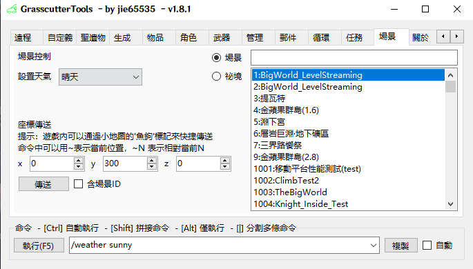

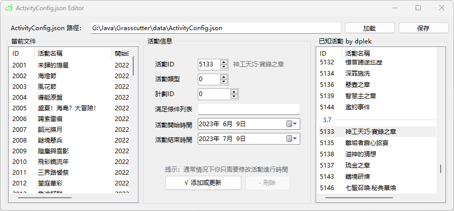

### GrasscutterTools-v1.9
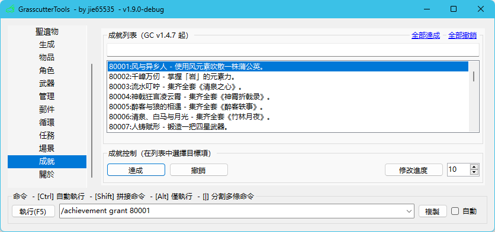

### GrasscutterTools-v1.8
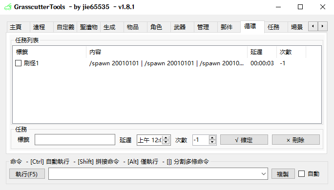

### GrasscutterTools-v1.7.3


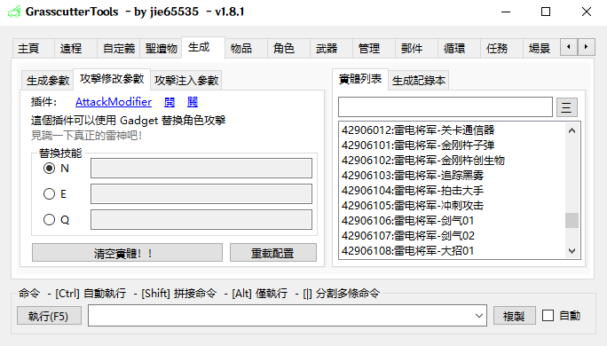

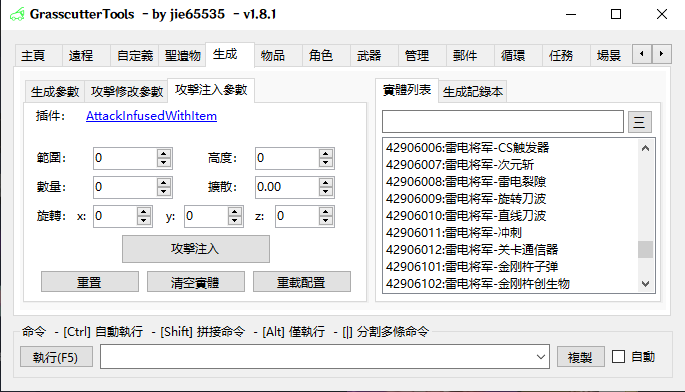

新增 [攻擊修改](https://github.com/NotThorny/AttackModifier)、[攻擊注入](https://github.com/snoobi-seggs/AttackInfusedWithItem)、[主角切換元素](https://github.com/Penelopeep/SwitchElementTraveller)等插件指令產生

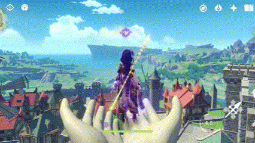

### GrasscutterTools-v1.7.2
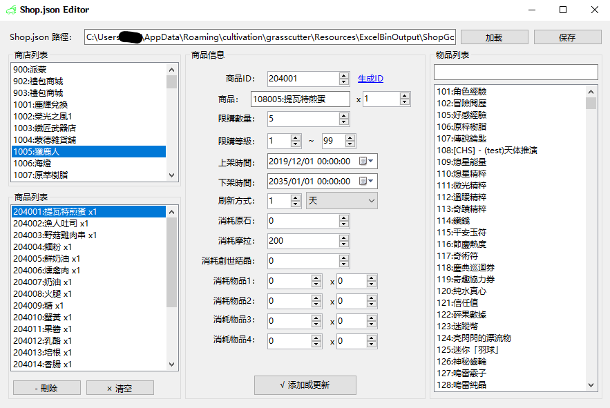

### GrasscutterTools-v1.7.1
 - 新增 Gadgets

### GrasscutterTools-v1.7.0

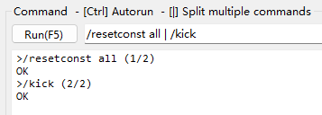

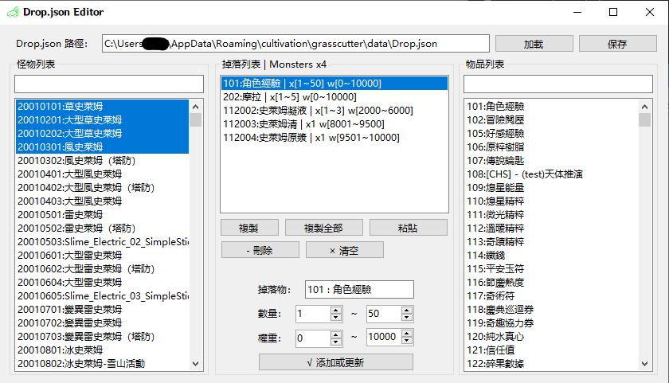

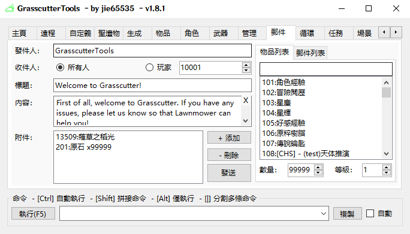

---


## 工具截圖

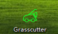

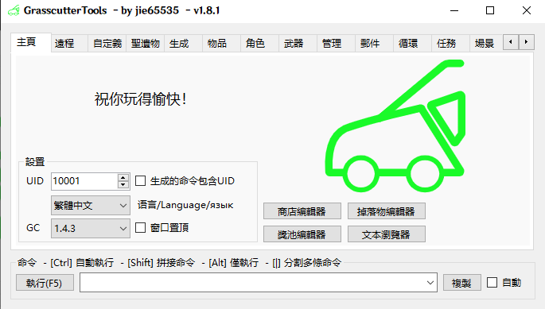

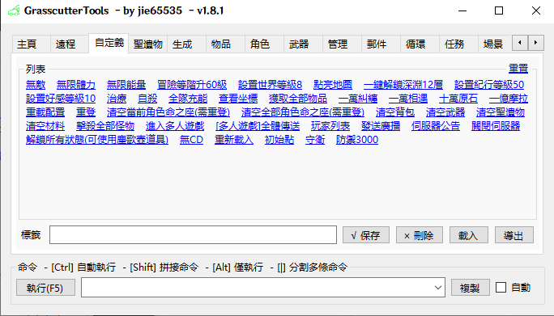

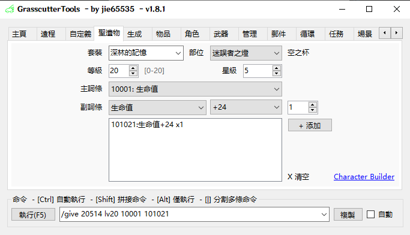

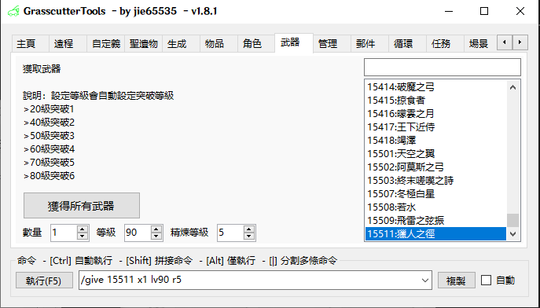

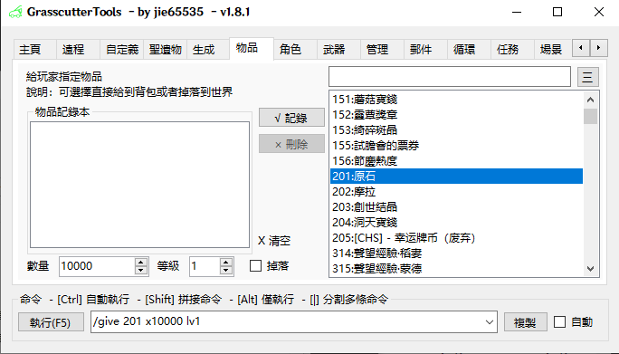

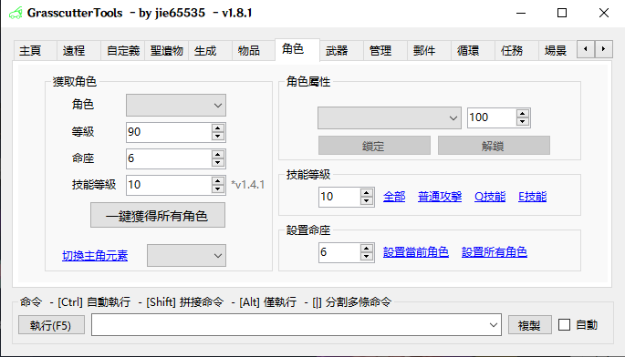


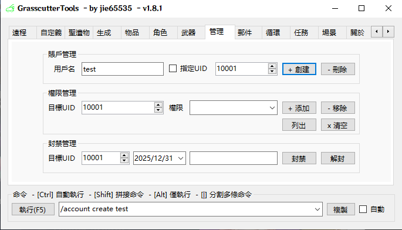

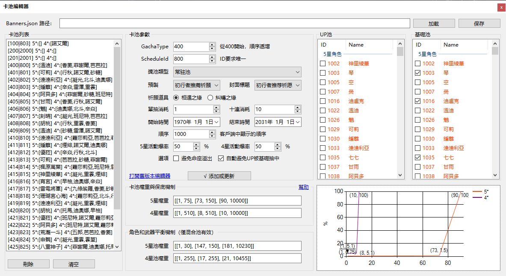

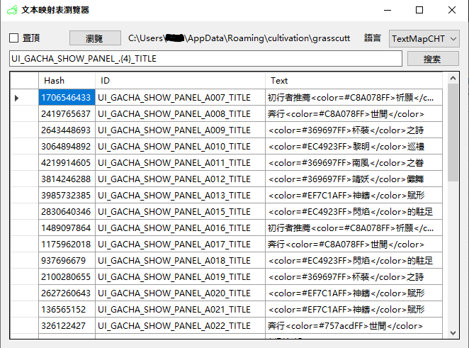

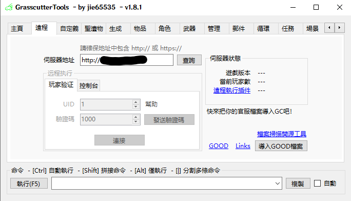

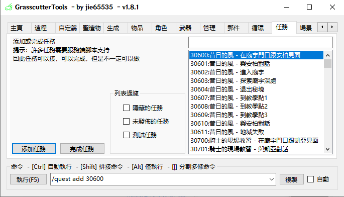
